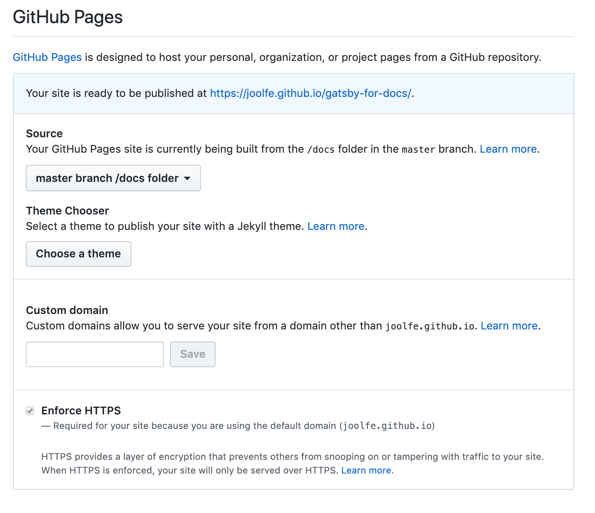
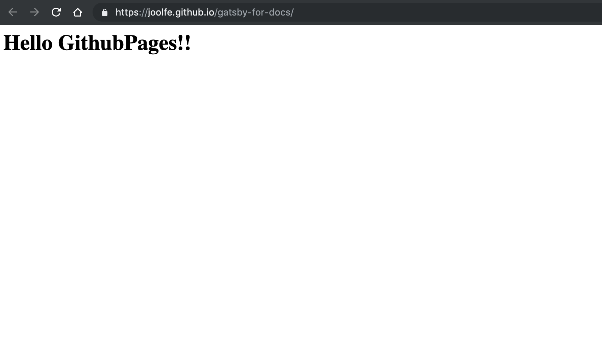
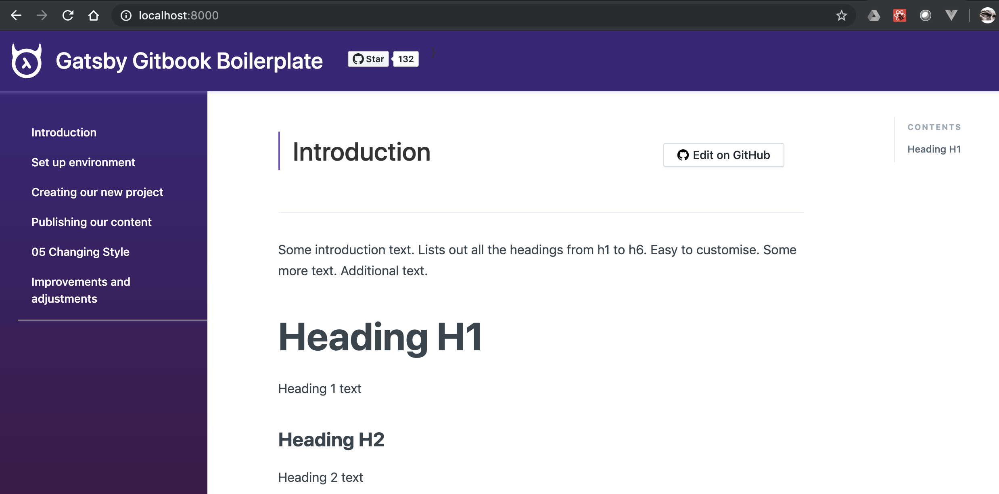
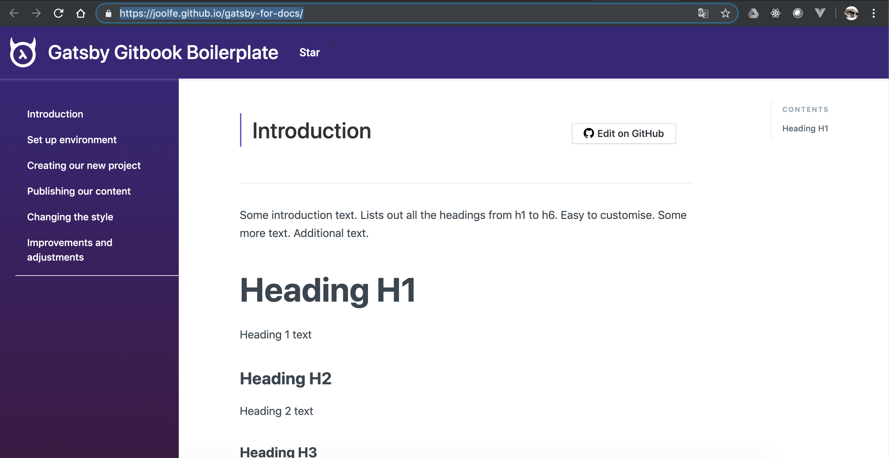

# Publish our first version

Our live/production server is going to be Github, using the [GitHub Pages](https://pages.github.com/) feature, why? well..it is free, work great and is the easiest option, can we wish more? 😙.


# Github set up

Before setting up Github we need to create some folders and files inside our project, so:
 1. Create a `/docs` folder in our project root.
 2. Inside this folder create a `/docs/index.html` file.
 3. Inside this file put a simple Html like `<h1>Hello GithubPages!!</h1>`

Ok, we are now ready to activate GitHub pages ✅, go to our recently created repo and navigate to **Settings** tab, in this page, search for "GitHub Pages" section and choose the `/docs` folder option in the combo.



Without do anything else we have published a static page, just check in the URL that appears in the blue panel, in our case the URL  [https://joolfe.github.io/gatsby-for-docs/](https://joolfe.github.io/gatsby-for-docs/) show this:



We are online!! 🎉🎉🎉


# Creating content

It's time to start publishing our real content, one of the things I loved from Gitbook is how easy is to write docs in markdown, that's the reason why we are using [gatsby-gitbook-starter](https://www.gatsbyjs.org/starters/hasura/gatsby-gitbook-starter/) 😌.

So having a quick look into the starter documentation we see that all markdown content should be placed in the folder `/content` and already inside this folder, there are some examples.

```bash
$ ls
codeblock.md  index.mdx introduction.md
```

We can remove the examples because if need it, we can have a look into the original git repo so... and we already have some content to use (exactly what you are reading) so let us create some `.md` files, for example in the `01-introduction.md` file we will have:

```md
---
title: "Introduction"
metaTitle: "Tutorial introduction"
metaDescription: "Why I have write this tutorial?"
---


# Introduction

Welcome to the "gatsby-docs" tutorial, before start just let me explain the motivation to create this tutorial...

// file continue here...

```
<br/>

> Offcourse is out of the scope of this tutorial to teach how to write markdown 😅 if you need info just have a look into google are tons of tutorial about this.

And we continue adding files until we have something like this inside the `content` folder: 

```bash
$ ls
index.mdx
01-introduction.md
02-setup-environment.md
03-new-project.md   
04-publishing-content.md
05-changing-style.md
06-fixing-improving.md
```

We have name our file starting with the number of the chapter so while we are editing the files maintain the order. Now we can test our content in local, so just execute:

```bash
$ gatsby develop
```

But this time when we go to `http://localhost:8000/` we see an error screen


Oh no 😓!!. "Keep calm and carry on" we can see in the error message that is something related with `.concat(navItems.items)` and this seems to be the menu... ups! we have forgotten to add our new page to the menu and remove the old ones.

To do this open the `config.js` file that is on the root folder of our project.
 if you look for `sidebar` you will see this code:

> The `config.js`  file is a helper file for configuration, is something added by the authors of the template, is like a complement for the `gatsby-config.js` file which is the config file in a gatsby site.

```json
"sidebar": {
 "forcedNavOrder": [
 "/introduction",
 "/codeblock"
 ]
```

Here we are choosing the order of the files in our documentation left menu and `codeblock.md` file not exist anymore, so to solve this we can leave this property with an empty array `[]` because we are already ordering the files with a number of the chapter so we don't need to "force the navigation order", in our file we will put this code:

```json
"sidebar": {
 "forcedNavOrder": [],
 ... // the file continue here
```

if we run again the command:

```bash
$ gatsby develop
```

It's working now! 👏👏👏 




# Now publish our content

In local our static docs are working fine, now is time to publish to the world 🌍! It is going to be our first deploy to **production** environment.

While testing in local our site, when we execute the command `$ gatsby develop` in terminal,this message appear at the end of the execution "To create a production build, use npm run build", that's because normally when you are testing and debugging in develop you prefer to compile fast and to have a hot reload server.. but for production you want your sources minimized and everything more compact.

So let us try the command `$ npm run build` in the terminal... after a little more time than when we use the develop command we get:

```bash
info Done building in 31.865 sec
```

Great our static doc is ready for deployment. Should be as easy as `push` ⬆️ content to the GitHub but there are a consideration, gatsby by default generate the static sources in a folder called `/public` and we need to put everything inside our repo `/docs` folder, because we have configured in this way in GitHub (remember chapter 3 of this tutorial).

To avoid move files manually (copy+paste) all the times that we build our project, let us add a command in the npm scripts, if you open the `package.json` file and look for the script field you will see this:

```json
 "scripts": {
 "start": "gatsby develop",
 "build": "gatsby build --prefix-paths"
 }
```

We are going to add inside the `build` script a command to move the content from **public** folder to **docs** folder, is as easy as `mv public/* docs/`

> I'm using MacOS 🍎for those using Windows or other SO [see here](https://www.computerhope.com/issues/ch001476.htm)

So after building sources, this command is going to copy build results into the docs folder, let us try using again the command

```bash
$ npm run build
```

This time when the process is finished if we go to the `/docs` directory we can see our recently created static content 😊

So time to publish on GitHub, we use the next commands to push the content and GitHub will automatically publish after some seconds:

```bash
$ git add --all 
$ git commit -m 'trying to publish'
$ git push
```

And if we navigate to `https://joolfe.github.io/gatsby-for-docs/` we can see that our page is there!! 🎉🎊


