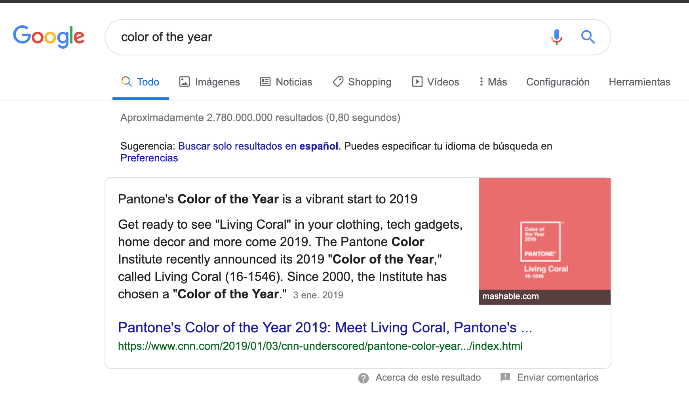
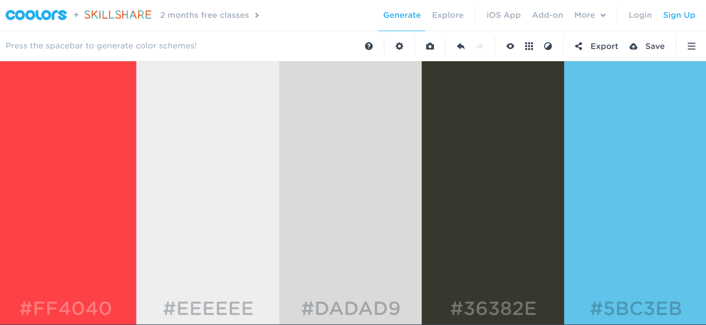
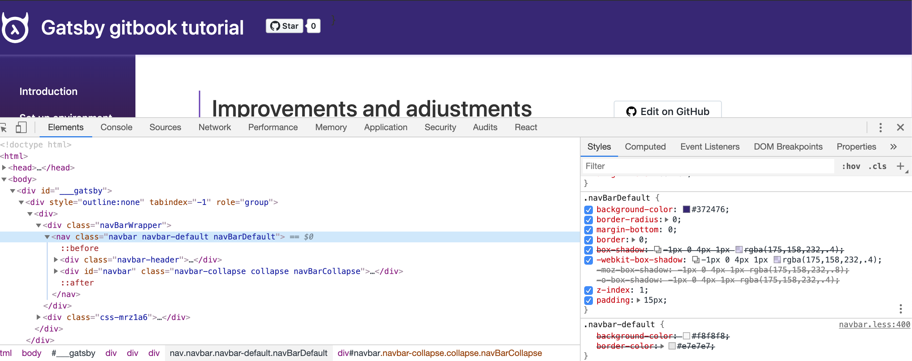
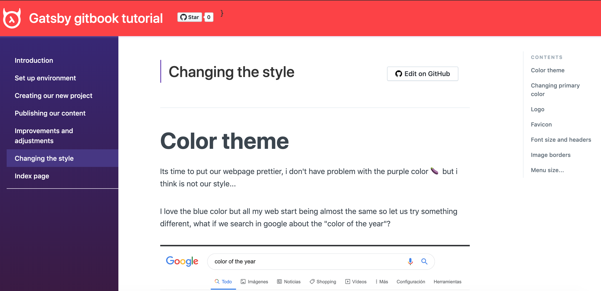
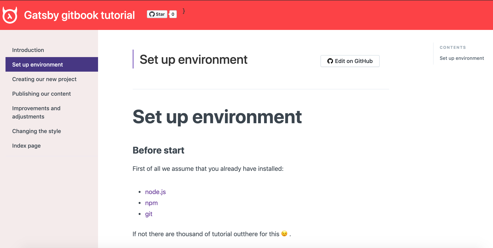

# Color theme

Its time to put our webpage prettier, i don't have problem with the purple color 🍆 but i think is not our style...

I love the blue color but all my web start being almost the same so let us try something different, what if we search in google about the "color of the year"? 



😵 WOW, this thing exits hahaha, ok so let us use the color of the year that is "Living Coral" as our inspiration.

When i work in themes i like to first generate a color palette, I'm not too strict with colors but just to have a base to work on. A online tool that i like a lot is [coolors](https://coolors.co/), beacuse is an easy way to generate random palette and adjust to your likes.

We start in the first column putting our coral `#FF4040` and "locking" the color, then clicking on the space bar colors start change, after do this process some times we get this:



> This is the link of [our final palette](https://coolors.co/ff4040-eeeeee-dadad9-36382e-5bc3eb) as colors are in the url you can share or save very quickly  🌈

# Changing primary color

Our primary color then is going to be the coral `#FF4040`, so our header must be thata color.

To see where is the color defined let us use the [Chrome DevTools](https://developers.google.com/web/tools/chrome-devtools/?hl=en), so just right click on the header 



And we can see that header `background-color` comes from css class `navBarDefault`, if we search for this inside the `/src` folder we will find that this css class is located into `src/components/styles.css` so let us just change it 😌.

> We are going to follow this process to find out all the css classes that we need to change but is not going to be described anymore 😉.

Gatsby develop server comes with "hot reload" so change sin css files will be updated automatically in the browser, in our case we see:



Cool!

# Left menu color

In the case of the left menu i think also put a coral is not our style, i prefere something that makes the tutorial more redable, maybe the second color in our pallete `#EEE`.

In this case if we use DevTools we see a strange css class called `css-1h18y8r` umm more than sure this numbers means is a "compiled" style, and we confirm when try to search in the `src` file because get 0 results...

Weel we cannot forget that we are using gatsby and react so this should be because the style is inside the component. Just having  alook to the `src/component` folder we see a `sidebar.js` file and in the code we can some css code:

```
const Sidebar = styled('aside')`
  width: 100%;
  /* background-color: rgb(245, 247, 249); */
  /* border-right: 1px solid #ede7f3; */
  height: 100vh;
  overflow: auto;
  position: fixed;
  padding-left: 24px;
  position: -webkit-sticky;
  position: -moz-sticky;
  position: sticky;
  top: 0;
  padding-right: 0;
  background-color: #372476;
  /* Safari 4-5, Chrome 1-9 */
  background: linear-gradient(#372476, #3b173b);
  background: -webkit-gradient(linear, 0% 0%, 0% 100%, from(#372476), to(#3b173b));
  /* Safari 5.1, Chrome 10+ */
  background: -webkit-linear-gradient(top, #372476, #3b173b);
  /* Firefox 3.6+ */
  background: -moz-linear-gradient(top, #372476, #3b173b);
  /* IE 10 */
  background: -ms-linear-gradient(top, #372476, #3b173b);
  /* Opera 11.10+ */
```

The background is defined using a `background-color` but also there are gradients using `background`, in our case we want just a plane color so just add our color and remove the rest, i mean put this `background-color: #EEE` and just after the change we get in browser this:


😣 ummm colors of the fonts are not working with the new background, let us fix this and put the same color that we are using in the rest of the text `#3b454e`, to change menu text color just in the same file `src/component/sidebar.js` a little lower in the code there are the css definition for links.



Better now, but still this purple color when the link is `active`, this is the code for this case:

```
    ${props =>
      props.active &&
      `
      color: #fff;
      background-color: #473485;
    `} // external link icon
```

We should remove the `background-color` and I'm going to use the primary color for the emphasys so we put `color: #FF4040`, this is the result:


Pretty isn't it? But wait! when we put the cursor on top of the menu options the purple color appear again, this is because we forget to change the `hover` css directive, we are going to use our third color `#DADAD9` and this is the final result:


How much beauty 😢.

# The strange character in header


# Logo


# Favicon


# Font size and headers

Put small the headers...

# Image borders


# Menu size...

Esta bailando todo el rato.


