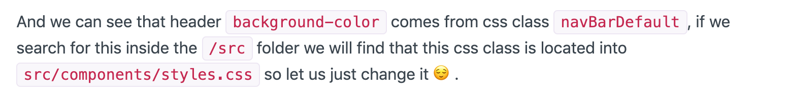
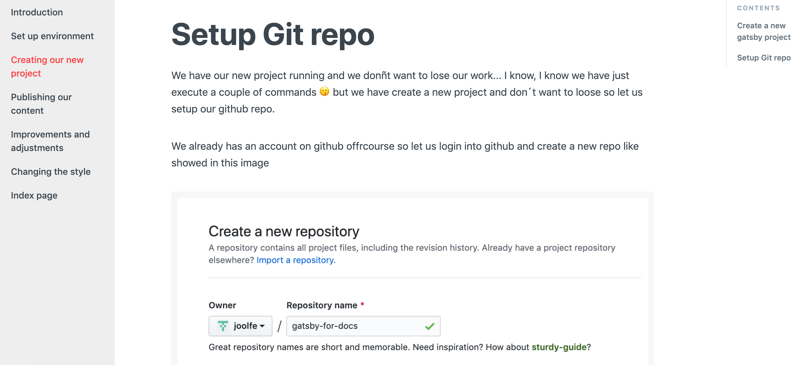
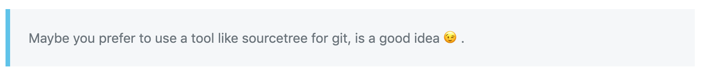
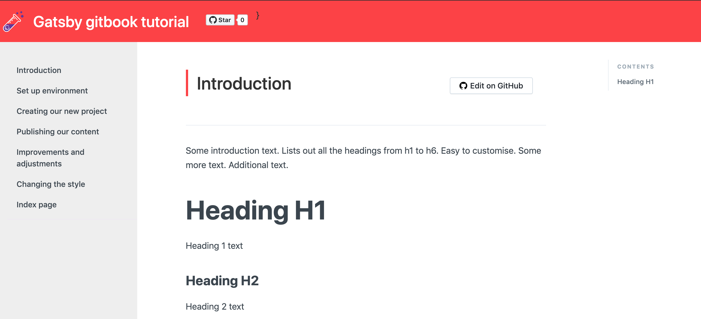
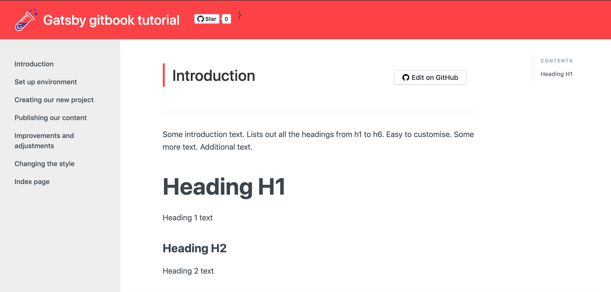

# Color theme

Its time to put our webpage prettier, i don't have problem with the purple color 🍆 but i think is not our style...

I love the blue color but all my web start being almost the same so let us try something different, what if we search in google about the "color of the year"? 


😵 WOW, this thing exits hahaha, ok so let us use the color of the year that is "Living Coral" as our inspiration.

When i work in themes i like to first generate a color palette, I'm not too strict with colors but just to have a base to work on. A online tool that i like a lot is [coolors](https://coolors.co/), beacuse is an easy way to generate random palette and adjust to your likes.

We start in the first column putting our coral `#FF4040` and "locking" the color, then clicking on the space bar colors start change, after do this process some times we get this:


> This is the link of [our final palette](https://coolors.co/ff4040-eeeeee-dadad9-36382e-5bc3eb) as colors are in the url you can share or save very quickly  🌈

<br/>

# Changing primary color

Our primary color then is going to be the coral `#FF4040`, so our header must be thata color.

To see where is the color defined let us use the [Chrome DevTools](https://developers.google.com/web/tools/chrome-devtools/?hl=en), so just right click on the header 


And we can see that header `background-color` comes from css class `navBarDefault`, if we search for this inside the `/src` folder we will find that this css class is located into `src/components/styles.css` so let us just change it 😌.

> We are going to follow this process to find out all the css classes that we need to change but is not going to be described anymore 😉.

Gatsby develop server comes with "hot reload" so change sin css files will be updated automatically in the browser, in our case we see:


Cool!

<br/>

# Left menu color

In the case of the left menu i think also put a coral is not our style, i prefere something that makes the tutorial more redable, maybe the second color in our pallete `#EEE`.

In this case if we use DevTools we see a strange css class called `css-1h18y8r` umm more than sure this numbers means is a "compiled" style, and we confirm when try to search in the `src` file because get 0 results...

Weel we cannot forget that we are using gatsby and react so this should be because the style is inside the component. Just having  alook to the `src/component` folder we see a `sidebar.js` file and in the code we can some css code:

```jsx
const Sidebar = styled('aside')`
  width: 100%;
  /* background-color: rgb(245, 247, 249); */
  /* border-right: 1px solid #ede7f3; */
  height: 100vh;
  overflow: auto;
  position: fixed;
  padding-left: 24px;
  position: -webkit-sticky;
  position: -moz-sticky;
  position: sticky;
  top: 0;
  padding-right: 0;
  background-color: #372476;
  /* Safari 4-5, Chrome 1-9 */
  background: linear-gradient(#372476, #3b173b);
  background: -webkit-gradient(linear, 0% 0%, 0% 100%, from(#372476), to(#3b173b));
  /* Safari 5.1, Chrome 10+ */
  background: -webkit-linear-gradient(top, #372476, #3b173b);
  /* Firefox 3.6+ */
  background: -moz-linear-gradient(top, #372476, #3b173b);
  /* IE 10 */
  background: -ms-linear-gradient(top, #372476, #3b173b);
  /* Opera 11.10+ */
```

The background is defined using a `background-color` but also there are gradients using `background`, in our case we want just a plane color so just add our color and remove the rest, i mean put this `background-color: #EEE` and just after the change we get in browser this:


😣 ummm colors of the fonts are not working with the new background, let us fix this and put the same color that we are using in the rest of the text `#3b454e`, to change menu text color just in the same file `src/component/sidebar.js` a little lower in the code there are the css definition for links.


Better now, but still this purple color when the link is `active`, this is the code for this case:

```jsx
    ${props =>
      props.active &&
      `
      color: #fff;
      background-color: #473485;
    `} // external link icon
```

We should remove the `background-color` and I'm going to use the primary color for the emphasys so we put `color: #FF4040`, this is the result:


Pretty isn't it? But wait! when we put the cursor on top of the menu options the purple color appear again, this is because we forget to change the `hover` css directive, we are going to use our third color `#DADAD9` and this is the final result:


How much beauty 😢.

<br/>

# Rest of the colors...

We have change most visible color elements but there are other elements that still has the purple color,
- Links `<a>` (css in `src/template/docs.js`)
- Links in right menu on hover (css in `src/comonents/rightSidebar.js`)
- Line near to the page title (css in `src/components/styles.css`)
- Navigation buttons in bottom of the page (css in `src/components/styles.css`)

I'm not going to repeat the steps here, we just look for css classes using devtools and change the value in the static css file or dinamic classes inside components code.

All this color will be replaced by our wonderfull primary color `#FF4040`.

Also for add a little contrast we are going to use our secondary color `#5BC3EB` in inline code blocks, actually has this look



And after change the css in `sr/components/mdxComponents` (basically adding `color: #5BC3EB;`) we obtain this:


Cool! 🤘

<br/>

# Image borders

Some images in our tutorial don't looks pretty well, like for exmaple this one:


If you look carefully the github form is a picture but seems part of our text 😩, to avois this effect we are going to put a border around images, and for maintain the style coherence we are going to use the same border that already has our code blocks.

We just do right click in a code block and inspect the css, the trick to do the border is very elegant, just use:

```css
    background-color: #f5f7f9;
    padding: 9.5px;
    border-radius: 4px;
```

So we can add into the `src/componenets/styles.css` file a new css rule to make all images that are inside the main body (we don't want to put a border to the logo for example 😗) have the border, this code should work:

```css
.mainWrapper img {
    background-color: #f5f7f9;
    padding: 9.5px;
    border-radius: 4px;    
}
```
If we refresh in local we will see this:



Awesome! 💪

<br/>

# Quote panels

Other piece that we can improve are the Qoute panel, I mean elements that appear when we use in markdown a quote like this:

```md
> Hi! this is a quote :-)
```

In our tutorial has this style


Too much discreet for my taste, so let us put some of color to this panel, I think we can use our blue color as inspiration `#5BC3EB`, also add some background and fix the spacing of the component.

So we add this code into `src/componenets/styles.css` file:

```css
blockquote {
  padding: 20px;
  font-size: 14.5px;
  border-left: 5px solid #5BC3EB;
  background-color: #f5f7f9;
  color: #6b747b;
}

blockquote p:first-child{
    margin-top: 0px;
}
```

If we test in local we can see this



<br/>

# Logo

We are going to add our custom logo to the web 😊, because we are "experimenting" with **gatsby** I have think in merge the concept of experiment and gatsby, for experiment i have think somehting like a test tube and for gatsby just the logo, so the result is this:


I know, I know... I'm not a designer 😝 so this should work...

If you remember while seting up the meta we see a **logo** property inside `config.js` file, concretely in header section that looks like:

```json
	"header": {
		"logo": "https://graphql-engine-cdn.hasura.io/img/hasura_icon_white.sv",
		"title": "Gatsby gitbook tutorial",
		"githubUrl": "https://github.com/joolfe/gatsby-for-docs",
		"helpUrl": "",
		"tweetText": "",
		"links": [{ "text": "", "link": ""}],
	}
```

Ummm... but this logo is an outside resource... we want to use a logo in **svg** format and the resource will be inside our files 😕.

Let's have a look to the code that print the logo (remeber using DevTool...), we get this:

```html
<a aria-current="page" class="navbar-brand navBarBrand" href="/gatsby-for-docs/">
    
    Gatsby gitbook tutorial
</a>
```

So we search in our files for the css class `navbar-brand navBarBrand`, we easily find that is inside file `src/components/Header.js`, ok makes sense jejeje.

The code that print the logo is this one:

```jsx
    <Link to="/" className={'navbar-brand navBarBrand'}>
    {logo !== '' ?
        ()
        :
        ()
    }
    {headerTitle}
    </Link>
```

Is very easy to understand, if in the config we have the **logo** parameter filled then this value is used, if not then use `{logoImg}`, just in same file a little early we found the definition of this variable `const logoImg = require('./images/logo.svg');`, so bascally is using a static resource inside folder `src/images`, that's greate because is exactly what we need 😏.

So to use our logo we just copy our svg image into `src/images` folder and put a empty value for **logo** field in in the `config.js` file.

Time to test in local with `$ gatsby develop` and go to the browser to found:



Wow our logo is there, but... for my taste is very small and is too near to left side, we can adjust this with some css code inside `src/components/style.css` like this:

```css
.navBarBrand img {
    width: 50px;
    margin-right: 10px;
    margin-left: 30px;
    display: inline-block;
}
```

An the result is just perfect 😃




