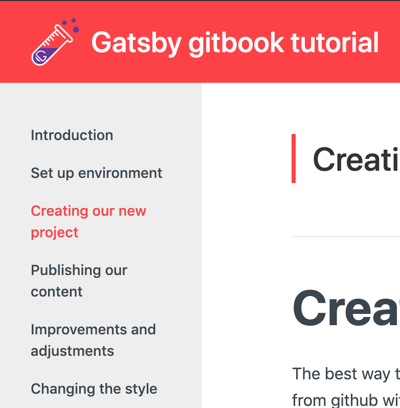

Even if the template we have chosen is greate there are some errors in the code that we will fix next 

# The strange character in header

After change the styles, colors, logo... a strange character start appearing in the header, look the image:


You can see a character `}` at the end of the header 😣. 
Let us review the header code to see what's happening 😕. for this we go to `src/components/Header.js` file and just having a look around the `GitHubButton` we see that there are an orphan `}` character here 😑, we remove and that's all!

If we review the original Github template (or starter) in the demo we can also see this error


So is nothing related with our changes 😜, we probably can do a merge request to fix this in the original repo but this is not part of this tutorial...


# Right menu navigation

If we try to use **right side menu bar** links to navigate inside a page, we notice that doesn't work 😰, for example, testing llocally in our page `http://localhost:8000/05-fixing-improving` when click on  **Google analytics** link we can see that URL changes for `http://localhost:8000/05-fixing-improving#Google%20analytics` but the scroll doesn't change... It is easy to imagine that the spaces translated to HTML as `%20` are the problem.

This kind of links are also known as **Bookmarks**, you can read more about this [here](https://www.w3schools.com/html/html_links.asp), and seems to don't accept spaces so to solve this we are going to change spaces for underscores characters `_`.

We need to change in two places:

- In Navbar: File `src/components/rightSidebar.js`, to make links point to anchor with underscores.
```jsx
 return (
 	<ListItem
 		key={index}
 		to={`#${innerItem.title.replace(/\s+/g,"_")}`}
 		level={1}
 	>
 	{innerItem.title}
 	</ListItem>
 );
```
- In Headers: File `src/components/mdxComponents/index.js`, the id should be the same as the link.
```jsx
 h1: props => <Heading id={props.children.replace(/\s+/g,"_")} {...props} is="h1" fontSize={[5, 42]} />,
 h2: props => <Heading id={props.children.replace(/\s+/g,"_")} {...props} is="h2" fontSize={[4]} />,
 h3: props => <Heading id={props.children.replace(/\s+/g,"_")} {...props} is="h3" fontSize={3} />,
 h4: props => <Heading id={props.children.replace(/\s+/g,"_")} {...props} is="h4" fontSize={2} />,
 h5: props => <Heading id={props.children.replace(/\s+/g,"_")} {...props} is="h5" fontSize={1} />,
 h6: props => <Heading id={props.children.replace(/\s+/g,"_")} {...props} is="h6" fontSize={0} />,
```

For both we are going to use the method `.replace(/\s+/g,"_")` to replace spaces for underscores. Again this error is not related with our changes, maybe another merge request here? 😉


# Menu size

After use the web we can see that the left side menu change the size depending on the content of the page, have a look at these images:




After review CSS code we see that is a template issue again (not our error 😜), is trying to use [FlexBox](https://www.w3schools.com/css/css3_flexbox.asp) feature but not with too much success... We need to change the `flex` values in the layout items (left nav bar, main content and right nav bar) to fix this issue. 

The `flex` CSS property is a shorthand property for the `flex-grow`, `flex-shrink`, and `flex-basis`, and using google DevTools we can play with these values to see what is the best for our case. After some testing we have decide to put:

- Left navbar: `flex: 1 0 18%`
- Main content: `flex: 1 0 68%`
- Rigth navbar: `flex: 1 0 14%`

We need to add this changes in the file `src/components/layout.js`, the layout is code looks like:

```jsx
const Layout = ({ children, location }) => (
 <ThemeProvider location={location}>
 <MDXProvider components={mdxComponents}>
 <Wrapper>
 <LeftSideBarWidth className={'hidden-xs'}>
 <Sidebar location={location} />
 </LeftSideBarWidth>
 <Content>
 <MaxWidth>{children}</MaxWidth>
 </Content>
 <RightSideBarWidth className={'hidden-xs'}>
 <RightSidebar location={location} />
 </RightSideBarWidth>
 </Wrapper>
 </MDXProvider>
 </ThemeProvider>
);
```

And we can find above in this file the definition of `LeftSideBarWidth`, `Content` and `RightSideBarWidth` here is where we need to put our CSS and our layout will work like a charm! ✨


# Code blocks

Another strange behavior in our template is syntax highlight in the code blocks, for example, look the next picture:


In our markdown file we have indicated the language in the code block using the syntax `´´´bash`, but don't have too much sense that words **new** and **for** are in blue... seems like code block is highlighted as java or javascript code even if we have indicated the language 😞.

Let us have look to the code, is easy to find, that file `src/components/mdxComponents/codeBlocks.js` is our candidate, and after a quick review we see that our starter is using [prism](https://prismjs.com/), a well-known syntax highlighter component, more concretely what is being used is a react render component, see the import sentence:

```js
 import Highlight, { defaultProps } from "prism-react-renderer";
```

And we cannot forget that at the top of that the template is using a mdx parser for get the markdown and generate the static content, after a few searchs in google we found this [page](https://mdxjs.com/guides/syntax-highlighting/), seems to be exactly what our gatsby starter is doing, and comparing the code we can see the probelm:

```jsx 
 <Highlight
 {...defaultProps}
 code={exampleCode}
 language="javascript"
 theme={prismTheme}
 >
```

In **Highlight** component the language parameter is hardcode to **"javascript"**, thats the problem 😏. Just reading a little more the [mdx docs](https://mdxjs.com/guides/syntax-highlighting/) we see a solution, we need to get the language from the `className` using `const language = className.replace(/language-/, '')`.

After some test we have see that `className` is not directly in the method, is a value inside the object `props[]` and also sometimes the value is not present so we have create a conditional definition to use **"javascript"** when className is not defined, so the code finally looks like:

```jsx
const language = props["className"] ? props["className"].replace(/language-/, '') : "javascript";
 return (
 <Highlight
 {...defaultProps}
 code={exampleCode}
 language={language}
 theme={prismTheme}
 >
```

Another fixed issue, great job! 👌


