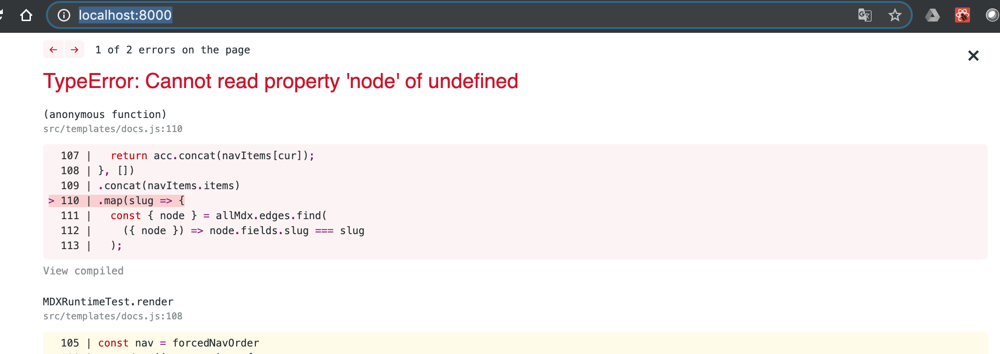

TODO
- Add quien soy en algun sitio.
- Poner en la pagina principal tecnologias que usamos no?


# Publish our first version

Our live/production server is going to be Github, using the [GitHub Pages](https://pages.github.com/) feature, why? well..it is free, work great and is the easiest option, can we wish more? 😙.

## Github set up

Before set up github need to create some folders and file sin our project, so:
   1. Create a `/docs` folder in our project root.
   2. Inside this folder create a `/docs/index.html` file.
   3. Inside this file put a simple html like `<h1>Hello GithubPages!!</h1>`

Ok we are now ready to activate github pages ✅, go to our recently created repo and navigate to "Settings" tab, in this page search for the "GitHub Pages" section and choose the /docs folder option in the combo.


Without do anything else we have publish a static page, just check in the url that appear in the blue panel, in our case [https://joolfe.github.io/gatsby-for-docs/](https://joolfe.github.io/gatsby-for-docs/) show this


We are online!! 🎉🎉🎉

## Now publish our content

Is time to start publishing our real content, one of the thing i loved from gitbook is the easy that is writte the docs in markdown, thats the reason why we are using  [gatsby-gitbook-starter](https://www.gatsbyjs.org/starters/hasura/gatsby-gitbook-starter/).

So having a quick look into the starter documentation we see that all markdown content should be place in the folder `/content` and already inside this folder we have some examples.

```
$ ls
codeblock.md	index.mdx	introduction.md
```
We can remove it because we can have look in the git repo if we need to see something... and we already have some content to use (exactly what you are reading) so let us create some `.md` files , for example in the `Introduction.md` file we will have:

```
---
title: "Introduction"
metaTitle: "Introduction"
metaDescription: "Introduction"
---

# Introduction

Welcome to the "gatsby-docs" tutorial, before start just let me explin the motivation to create this tutorial, my name is Jorge and i've been working as developer for more than 10 years

....
```

And we continue adding until we have something like this inside the `content` folder: 

```

```

Now we can test our content in local, so just execute:

```
$ gatsby develop
```
 But this time when we go to `http://localhost:8000/` we see an error screen

 

Oh no 😓!!

"Keep calm and carry on" we can see in the error message that is something related with `.concat(navItems.items)` and this seems to be the menu... ups! we have forget to add our new page to the menu and remove the old ones.

To do this open the `config.js` file that is on the root folder of our project, if you look for `sidebar` you will see this:

```
"sidebar": {
  "forcedNavOrder": [
    "/introduction",
    "/codeblock"
  ],
```

Here we are choosing the order of the files in our documentation and offcourse the `codeblock.md` file not exist anymore, so we can add here our recently created file in the order that we want as:

```
"sidebar": {
  "forcedNavOrder": [
    "/introduction",
    "/codeblock"
  ],
```


# Put our first content


# Style better


# Adding a way to sustain


